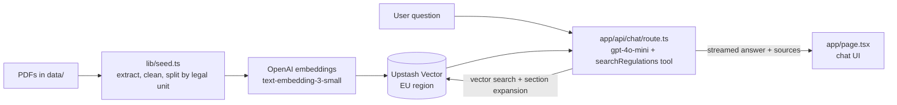

# CRA & Digital Security Act Assistant

A public retrieval-augmented (RAG) chat assistant that answers questions about the **EU Cyber Resilience Act** and **Norwegian digital security law**, with a citation for every key point.

**Live app:** https://cra-dsa-compliance-assistant.vercel.app

Built for *Week 14 – Ship Your Own RAG, Graded Mini Project 14.3*, starting from the Week 14A Next.js RAG starter.

> **Disclaimer:** This assistant provides information, not legal advice. Always check the official text and confirm decisions with legal counsel or the relevant authority.

---

## What it does

- Answers questions in **English or Norwegian**, and replies in the language of the question
- Grounds every answer **only** in the three source texts, and says so when the texts do not cover a question
- Cites provisions inline, for example `[CRA – Article 14]` or `[Digitalsikkerhetsforskriften – § 17]`
- Shows the retrieved sources under each answer, with a link to the official text
- Handles comparisons across laws, follow-up questions, and out-of-scope requests (for example NIS2)

## Corpus

| Document | Language | Source |
|---|---|---|
| Cyber Resilience Act – Regulation (EU) 2024/2847 | English | [EUR-Lex](https://eur-lex.europa.eu/eli/reg/2024/2847/oj) |
| Digitalsikkerhetsloven (Norwegian Digital Security Act) | Norwegian | [Lovdata](https://lovdata.no/dokument/NL/lov/2023-12-20-108?q=digitalsikkerhetsloven) |
| Digitalsikkerhetsforskriften (Norwegian Digital Security Regulation) | Norwegian | [Lovdata](https://lovdata.no/dokument/SF/forskrift/2025-06-20-1131?q=digitalsikkerhetsforskriften) |

The corpus produces **395 chunks**: 130 recitals, 71 articles and 8 annexes from the CRA, plus the § sections of the two Norwegian texts.

EU legislation on EUR-Lex may be reused with attribution (Commission Decision 2011/833/EU). Norwegian laws and regulations are not subject to copyright (åndsverkloven § 14). NIS2 and ISO standards are intentionally excluded: NIS2 is not yet in force in Norway, and ISO standards are copyrighted.

## How it works



1. **Ingestion (`lib/seed.ts`)** reads every PDF in `data/`, extracts text page by page, removes running headers and footers, and splits each document into legal units: Recitals, Articles and Annexes for the CRA, and § sections for the Norwegian texts. Long sections are split into parts with overlap. Each chunk is prefixed with a citation header (for example `CRA – Article 14 (Reporting obligations of manufacturers)`) and stored with document, section, chapter, page and source URL metadata.
2. **Retrieval as a tool call (`app/api/chat/route.ts`)**. The model decides when to call `searchRegulations`, which embeds the query and searches Upstash Vector, optionally filtered to one law.
3. **Section expansion**. If a top result is part of a split provision, the remaining parts of that provision are fetched as well, so the model sees the complete article or §.
4. **Streaming UI (`app/page.tsx`)** streams the answer, renders inline citation tags, and lists the retrieved sources with page numbers, match scores and links.

## Key design decisions

| Decision | Why | Trade-off |
|---|---|---|
| Split by legal unit instead of fixed windows | Chunks align with how the law is cited, and citations become precise | Requires document-specific parsing rules |
| Citation header inside each chunk | Improves retrieval and lets the model cite exactly | Slightly more tokens per chunk |
| Section expansion (top 3 results, up to 2 sections, max 10 parts) | Long provisions such as CRA Article 14 are answered completely | More context per answer, so slightly higher cost and latency |
| Cross-lingual retrieval without translation | Norwegian originals remain the authoritative text | Relies on the multilingual quality of the embedding model |
| Optional document filter on the search tool | Better comparisons across laws | Unknown values are ignored rather than rejected, to avoid crashes |
| Small built-in formatter instead of a Markdown library | No extra dependency, never injects HTML, only https links | Supports a limited Markdown subset |
| Sources panel capped at 8, expandable | Keeps answers readable | Some sources are hidden until expanded |

## Stretch goals

1. **Multi-PDF support**: all PDFs in `data/` are loaded, with document-specific titles, languages, source links and structure detection.
2. **Suggested-prompt chips**: the empty state offers four one-click questions and explains what the assistant knows.

## Tech stack

Next.js 15 · React 19 · Vercel AI SDK 4 · OpenAI (`gpt-4o-mini`, `text-embedding-3-small`) · Upstash Vector · Tailwind CSS · Vercel

## Run locally

**Prerequisites:** Node.js 20 or later, an OpenAI API key, and an Upstash Vector index with **1536 dimensions** and the **cosine** metric.

```bash
# 1. Install dependencies
npm install

# 2. Configure secrets (never commit this file)
cp .env.example .env.local
# fill in OPENAI_API_KEY, UPSTASH_VECTOR_REST_URL, UPSTASH_VECTOR_REST_TOKEN

# 3. Preview chunking without cost (writes seed-preview.json)
npm run seed -- --dry-run

# 4. Embed and upload (clears the index first)
npm run seed

# 5. Start the app
npm run dev
# open http://localhost:3000
```

To add a document, place the PDF in `data/`, add an entry for it in the `DOCS` register in `lib/seed.ts`, and run the seed again.

## Deploy

The app is deployed on Vercel with automatic deployments from the `main` branch. Set `OPENAI_API_KEY`, `UPSTASH_VECTOR_REST_URL` and `UPSTASH_VECTOR_REST_TOKEN` under **Project → Settings → Environment Variables**. Seeding runs locally, and the deployed app reads from the same Upstash index.

## Security and privacy

- API keys are used only on the server (`route.ts`, `seed.ts`) and never use the `NEXT_PUBLIC_` prefix. The live site was checked to confirm no keys appear in the page source, JavaScript bundles or network traffic.
- `.env.local` and `seed-preview.json` are excluded from Git.
- Server errors are logged in Vercel, and users see only a generic error message.
- OpenAI usage is protected by a monthly spending limit.
- The vector index is hosted in an EU region.
- Retrieved source text is visible in the browser. That is acceptable for public legislation, but a confidential corpus would need authentication and access control.

## Limitations and next steps

- No rate limiting or authentication yet
- No formal evaluation harness; testing has been manual, with a documented set of demo and edge-case questions
- Exact references such as "§ 17" rely on semantic search; hybrid (keyword + vector) retrieval would make them more reliable
- The corpus is a snapshot and needs a process for updates, including the CRA's EEA incorporation status in Norway

## Project structure

```
app/
├── api/chat/route.ts   # RAG-as-tool-call route with section expansion
├── layout.tsx          # page metadata
└── page.tsx            # chat UI, empty state, sources panel
data/                   # source PDFs (CRA and Norwegian texts)
lib/seed.ts             # ingestion: extract, clean, chunk, embed, upload
steps/                  # workshop reference snapshots from the starter
```
